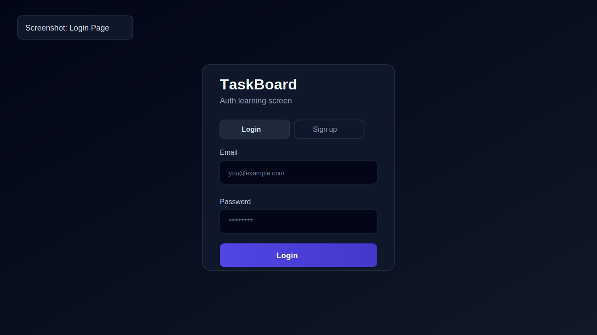
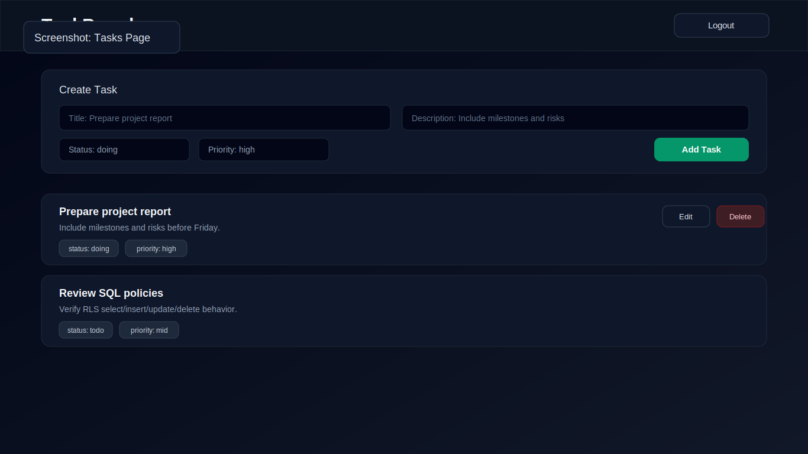
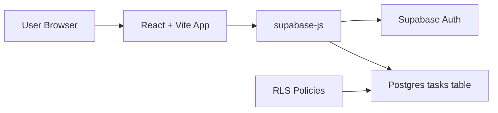

# React Supabase TaskBoard (Educational)

[](https://react.dev/)
[](https://www.typescriptlang.org/)
[](https://vitejs.dev/)
[](https://supabase.com/)
[](https://tailwindcss.com/)

React + Supabase で「認証付きタスク管理アプリ」を作りながら、フロントエンドとBaaS連携の基礎を学ぶための教材です。  
教育用として、実装の意図が追いやすい最小構成になっています。

## Table of Contents

- [この教材で学べること](#この教材で学べること)
- [スクリーンショット](#スクリーンショット)
- [アプリ概要](#アプリ概要)
- [技術スタック](#技術スタック)
- [ディレクトリ構成](#ディレクトリ構成)
- [セットアップ手順](#セットアップ手順)
- [RLSの学習ポイント](#rlsの学習ポイント)
- [授業での進め方サンプル](#授業での進め方サンプル)
- [動作確認チェックリスト](#動作確認チェックリスト)
- [よくあるエラー](#よくあるエラー)
- [発展課題](#発展課題)

## この教材で学べること

- [x] Supabase Auth を使ったメール/パスワード認証
- [x] React でのログイン状態管理（セッション監視）
- [x] Supabase Postgres への CRUD（Create / Read / Update / Delete）
- [x] TypeScript での型定義とフォームデータの扱い
- [x] Row Level Security (RLS) によるユーザー単位データ保護

## スクリーンショット

授業資料でそのまま使えるように、README上で見やすいサムネイル表示にしています。

| ログイン画面 | タスク管理画面 |
|---|---|
| [](docs/images/login-screen.svg) | [](docs/images/tasks-screen.svg) |

<details>
<summary>授業スライドで使うときのポイント</summary>

- ログイン画面: 認証UIと状態遷移の説明に利用
- タスク画面: CRUD操作とRLS確認の流れの説明に利用
- 必要なら同名ファイルを実スクリーンショットに差し替えるだけでREADME側はそのまま使えます

</details>

## アプリ概要

TaskBoard というシンプルなタスク管理アプリです。

- サインアップ/ログイン
- タスク作成
- タスク一覧表示（新しい順）
- タスク編集（タイトル/詳細/状態/優先度）
- タスク削除
- ログアウト

### アーキテクチャ



## 技術スタック

| 分類 | 技術 | 用途 |
|---|---|---|
| Frontend | React 18 | UI構築 |
| Language | TypeScript | 型安全な実装 |
| Build Tool | Vite 5 | 開発サーバー/ビルド |
| Styling | Tailwind CSS 4 | スタイリング |
| Backend (BaaS) | Supabase | Auth / Database / RLS |
| DB Client | `@supabase/supabase-js` | APIアクセス |

## ディレクトリ構成

```text
react_supabase/
├─ src/
│  ├─ App.tsx                  # セッション管理と画面切り替え
│  ├─ lib/supabase.ts          # Supabaseクライアント生成
│  ├─ pages/
│  │  ├─ LoginPage.tsx         # 認証画面
│  │  └─ TasksPage.tsx         # タスク一覧/CRUD画面
│  ├─ components/
│  │  ├─ AuthForm.tsx          # ログイン/サインアップフォーム
│  │  ├─ TaskForm.tsx          # 新規タスク作成フォーム
│  │  └─ TaskItem.tsx          # タスク表示/編集/削除
│  └─ types/task.ts            # Task関連の型定義
└─ supabase/sql/tasks_rls.sql  # テーブル作成 + RLSポリシー
```

## セットアップ手順

### 1. 前提

- Node.js 18 以上（推奨 20）
- npm
- Supabase プロジェクト

### 2. 依存関係のインストール

```bash
npm ci
```

### 3. 環境変数を設定

プロジェクトルートに `.env.local` を作成して、次を設定してください。

```env
VITE_SUPABASE_URL=https://YOUR_PROJECT_REF.supabase.co
VITE_SUPABASE_ANON_KEY=YOUR_SUPABASE_ANON_KEY
```

値の取得場所:
- Supabase Dashboard > Project Settings > API

### 4. DBスキーマとRLSを反映

Supabase Dashboard > SQL Editor で `supabase/sql/tasks_rls.sql` を実行してください。

このSQLで以下が作成されます。
- `public.tasks` テーブル
- インデックス
- RLS有効化
- `select / insert / update / delete` の4ポリシー

### 5. 開発サーバー起動

```bash
npm run dev
```

ブラウザで表示されたURL（通常 `http://localhost:5173`）へアクセスします。

## RLSの学習ポイント

この教材の重要テーマは「クライアント側で `eq("id", ...)` しているだけでは不十分」である点です。  
**最終防衛線は DB の RLS** です。

<details>
<summary>tasks テーブルのポリシー意図（クリックで展開）</summary>

- `tasks_select_own`: 自分のタスクだけ参照可能
- `tasks_insert_own`: `user_id` が自分自身のときだけ作成可能
- `tasks_update_own`: 自分のタスクだけ更新可能
- `tasks_delete_own`: 自分のタスクだけ削除可能

学習時は、別ユーザーでログインして同じタスクIDを操作しようとして失敗することを確認してください。
</details>

## 授業での進め方サンプル

| フェーズ | 学習内容 | 確認ファイル |
|---|---|---|
| 1 | Supabase接続と環境変数 | `src/lib/supabase.ts` |
| 2 | 認証フロー（サインアップ/ログイン） | `src/components/AuthForm.tsx`, `src/App.tsx` |
| 3 | 一覧取得と表示 | `src/pages/TasksPage.tsx`, `src/components/TaskItem.tsx` |
| 4 | 作成/更新/削除の実装 | `src/pages/TasksPage.tsx`, `src/components/TaskForm.tsx` |
| 5 | RLSでセキュリティを担保 | `supabase/sql/tasks_rls.sql` |

## 動作確認チェックリスト

- [ ] サインアップできる
- [ ] ログインできる
- [ ] タスクを追加できる
- [ ] タスクを編集できる
- [ ] タスクを削除できる
- [ ] ログアウトできる
- [ ] 別ユーザーのデータにアクセスできない（RLSが効いている）

## よくあるエラー

### `Supabase env is missing...`

`VITE_SUPABASE_URL` / `VITE_SUPABASE_ANON_KEY` が未設定です。  
`.env.local` の値を確認し、開発サーバーを再起動してください。

### ログインはできるがタスク操作が失敗する

`supabase/sql/tasks_rls.sql` が未実行、またはテーブル定義と実装がずれている可能性があります。  
SQL Editor で再実行してください（このSQLは再実行可能な構成です）。

## 発展課題

1. タスク検索（タイトル部分一致）
2. ステータス別フィルタ（todo/doing/done）
3. ページング（`range` を利用）
4. `updated_at` 自動更新トリガー追加
5. E2Eテスト追加（Playwright など）

## 注意

- 本リポジトリは教育目的のサンプルです。
- 本番運用時は監査ログ、エラートラッキング、入力バリデーション、レート制限等を追加してください。
